## **Business Question 1**
The business question: sales performance trend over time. Dimension to be considered is by year, and year plus region

### **Main Finding**
From 2020 to 2024, BMW's sales performance showed a fluctuating yet generally upward trend. Sales increased from 16,310,843 units in 2020 to a peak of 17,920,946 units in 2022, followed by a decline in 2023 to 16,268,654 units, and a recovery to 17,527,854 units in 2024. Regionally, Africa, Asia, Europe, and South America experienced growth until 2022, a decline in 2023, and varying recovery levels in 2024. Asia notably increased to 3,080,909 units in 2024. The Middle East remained stable, peaking in 2022, while North America saw a peak in 2022, a decline in 2023, and a slight decrease in 2024. Most regions peaked in 2022, declined in 2023, and partially recovered in 2024.

### **Supporting Figures**

    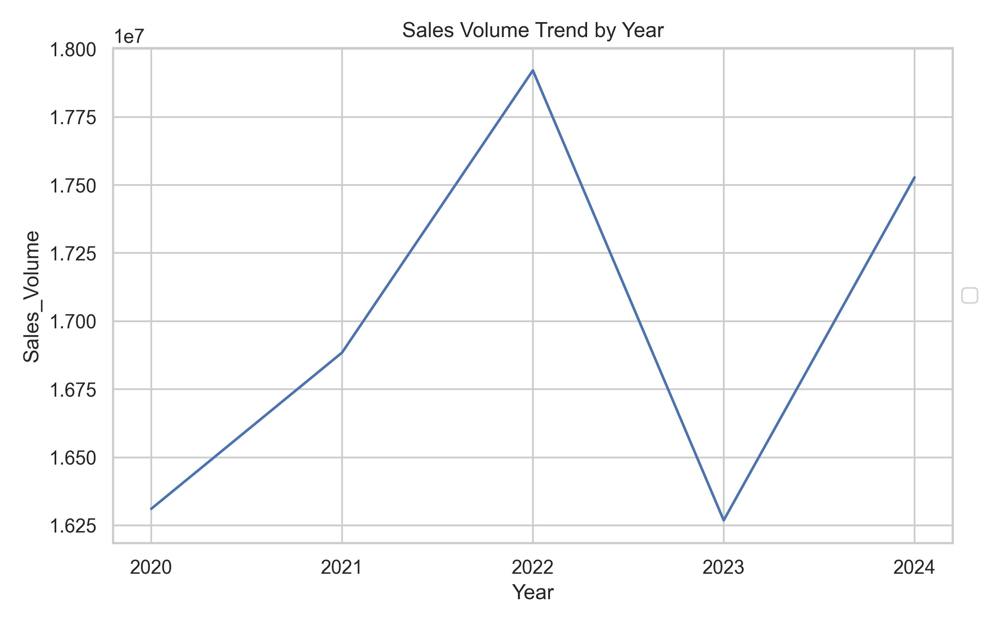
    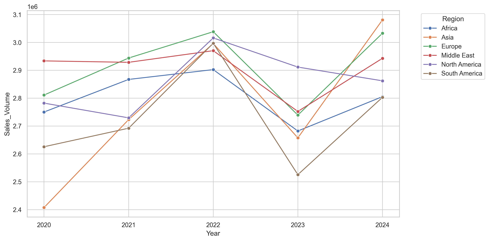

## **Business Question 2**
The business question: highlight top-performing and underperforming models or markets.

### **Main Finding**
The 7 Series and X6 are the top-performing BMW models, with sales volumes of 8,177,442 and 8,099,240 units, respectively. The M5 and 3 Series also perform well, while the X5, i3, and M3 underperform. Regionally, Europe leads with 14,565,989 units, followed by the Middle East and North America. Africa and Asia have moderate sales, while South America underperforms with 13,643,807 units. Europe, the Middle East, and North America are key markets, while South America presents growth opportunities.

### **Supporting Figures**

    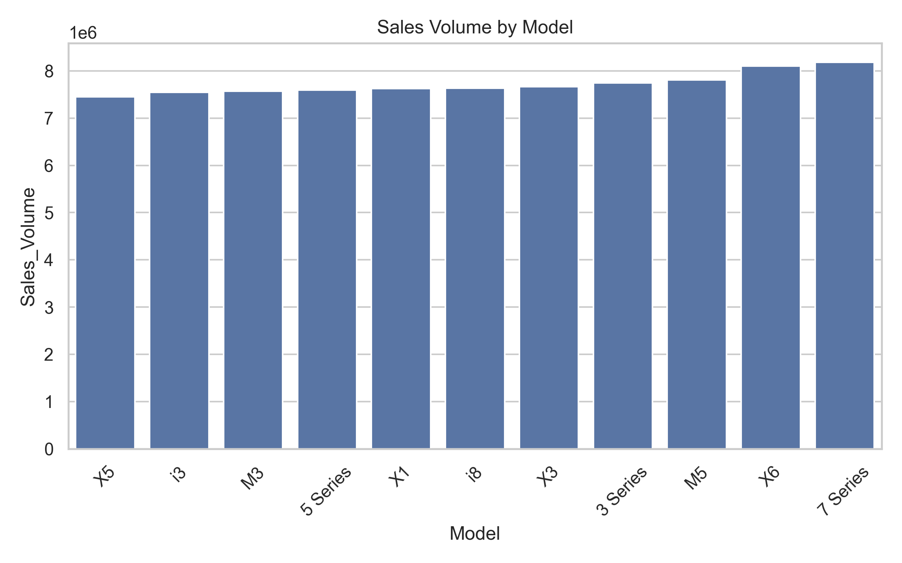
    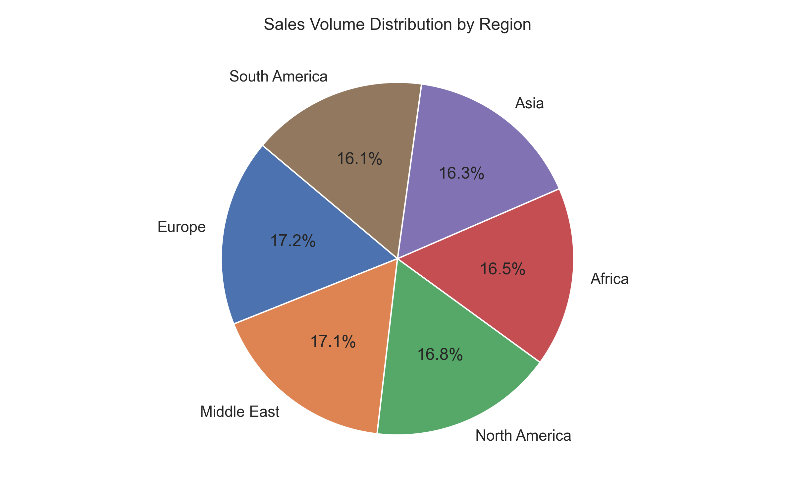

## **Business Question 3**
The business question: explore key drivers of sales (e.g., price, market segment, or model type), compare across dimensions. Market segment refers to color, fuel_type, transmission and engine_size. For price and engine_size, use Price_USD_Category and Engine_Size_L_Category fields.

### **Main Finding**
Key sales drivers include mid-range pricing ($75,000 to $100,000), popular models like the 7 Series, and market segments such as Hybrid fuel type and smaller engine sizes. Black, Red, and White are the most popular colors, with Hybrid vehicles leading in sales volume. Manual transmissions slightly outperform automatic ones. Smaller engine sizes (0 to 2.4 liters) have the highest sales, with a decline in sales as engine size increases.

### **Supporting Figures**

  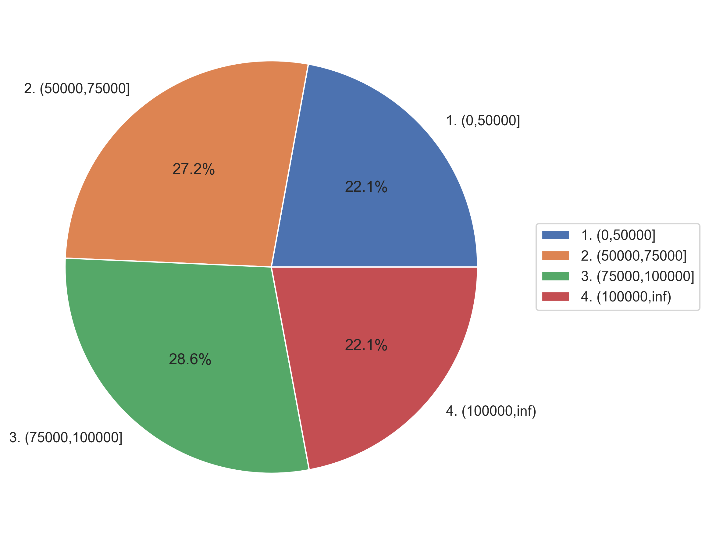
  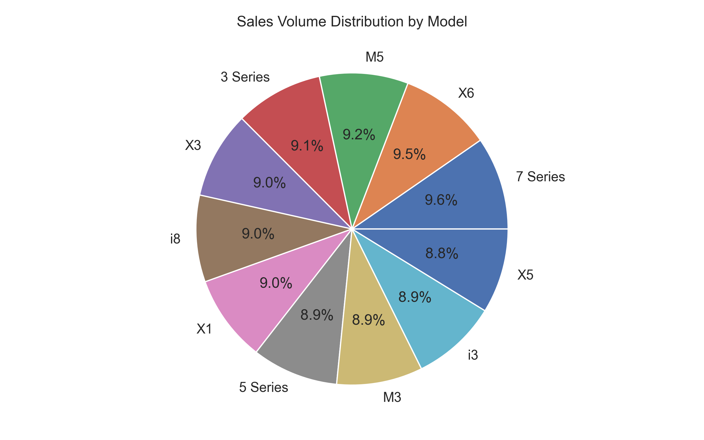
  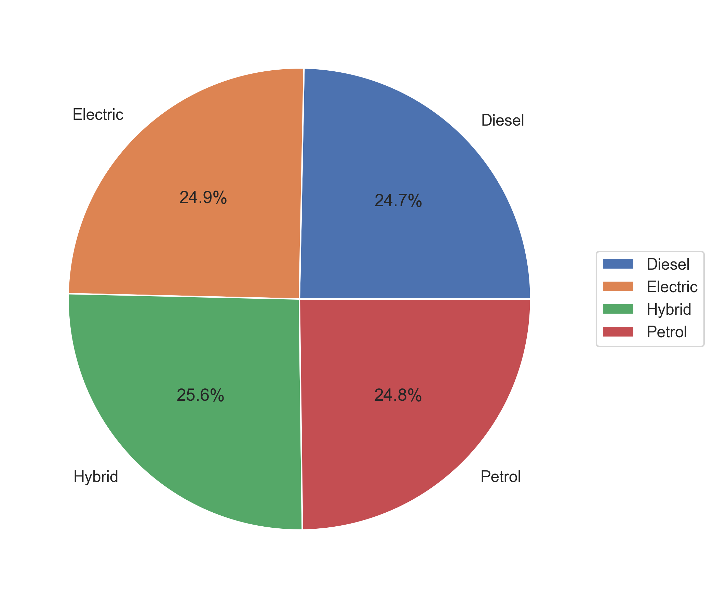

## **Business Question 4**
The business question: identify product market fit of each region.

### **Main Finding**
Europe and the Middle East lead in sales volume, with North America also performing well. Africa and Asia have similar sales volumes, while South America lags. The 3 Series is popular across regions, while the M3 underperforms. Asia has the highest pricing, while South America has the lowest. Hybrid and Electric vehicles are popular, with Diesel varying. Manual transmissions are slightly preferred in Europe and the Middle East. Smaller engines are favored across regions, with Europe leading in mileage categories. Color preferences vary, with Black and Grey popular, and regional variations like Blue in Africa and White in South America.

### **Supporting Figures**

    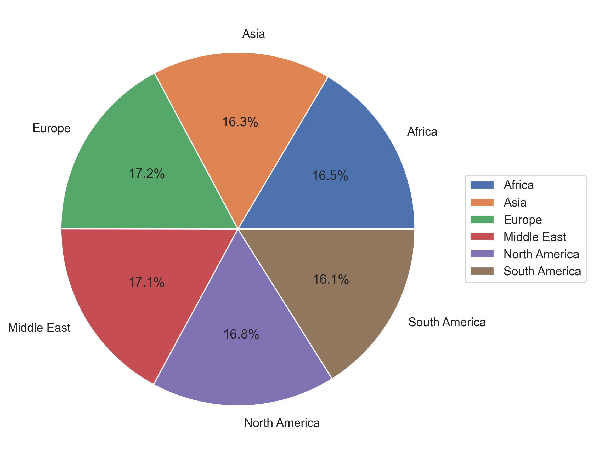
    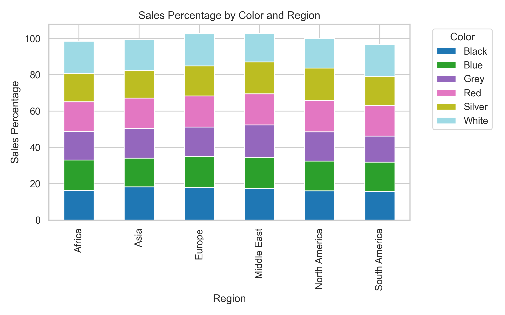
    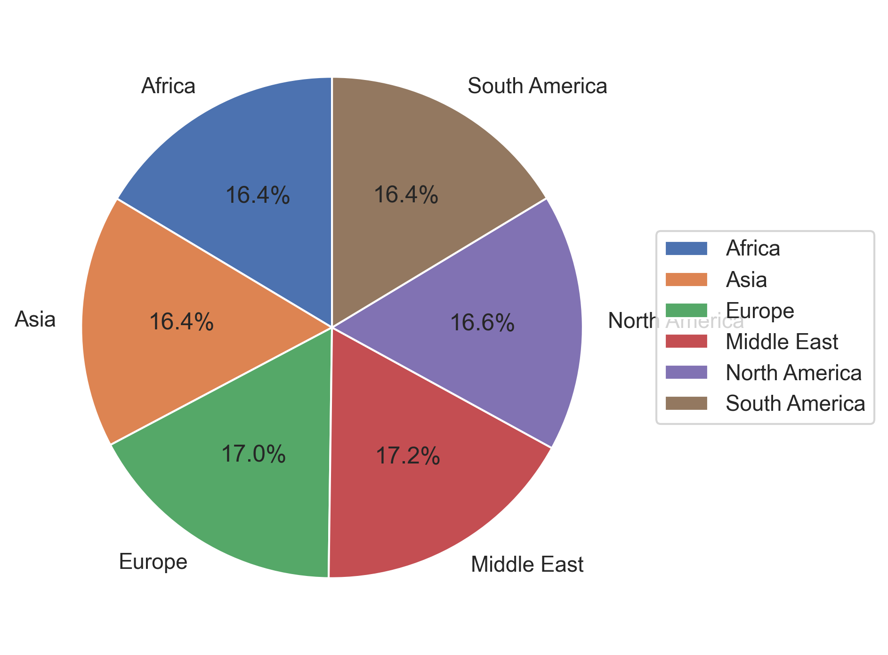

## **Business Question 5**
The business question: shift in consumer preference over time (e.g., model, color, fuel_type, transmission, Engine_Size_L_Category or Price_USD_Category). Use sales percentage as main metric.

### **Main Finding**
From 2020 to 2024, consumer preferences shifted towards the X6 model, Blue color, and Electric and Hybrid vehicles. Manual transmissions overtook automatic ones in 2021. Smaller engine sizes gained popularity, while mid-range priced vehicles remained dominant. There was a slight increase in preference for lower-priced vehicles, with a minor decline in higher-priced ones. These shifts indicate a trend towards economical and environmentally friendly options and changing aesthetic preferences.

### **Supporting Figures**

    
    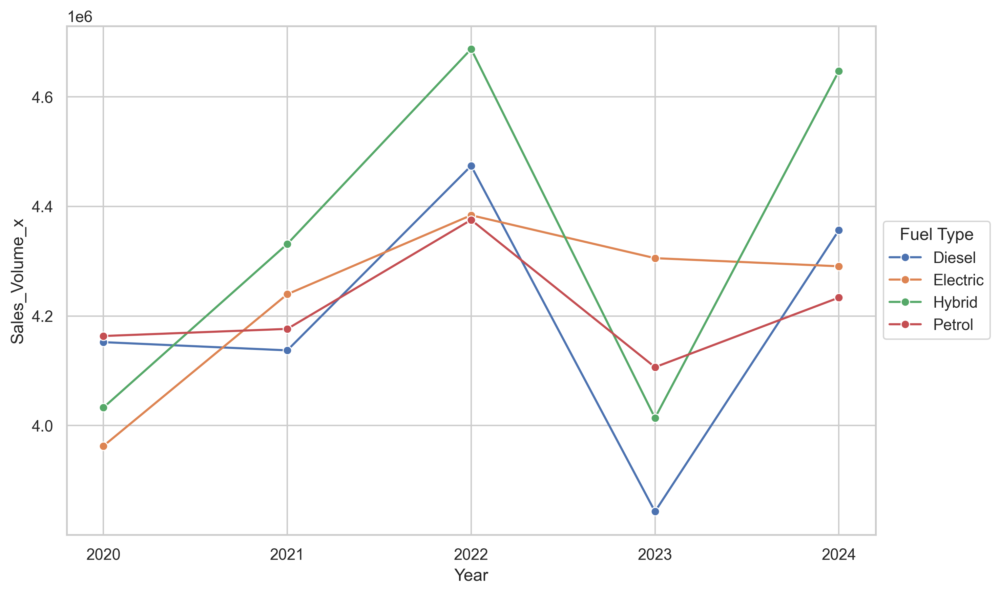
    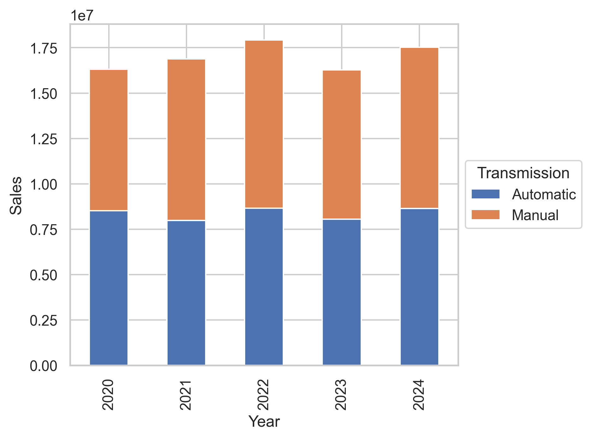

## **Conclusion**
The analysis of BMW's sales data from 2020 to 2024 reveals a generally upward trend in sales, with a peak in 2022, a decline in 2023, and a recovery in 2024. The 7 Series and X6 models are top performers, while the X5, i3, and M3 underperform. Europe, the Middle East, and North America are key markets, with South America presenting growth opportunities. Key sales drivers include mid-range pricing, popular models, Hybrid fuel types, and smaller engine sizes. Consumer preferences have shifted towards more economical and environmentally friendly options, with a notable increase in demand for Electric and Hybrid vehicles, manual transmissions, and smaller engines.

## **Actionable Insight**
To capitalize on these findings, BMW should focus on strengthening its presence in underperforming markets like South America by tailoring marketing strategies to regional preferences. Emphasizing the production and promotion of popular models like the 7 Series and X6, along with expanding the range of Hybrid and Electric vehicles, could further boost sales. Additionally, BMW should consider enhancing its offerings in the mid-range price category and continue to innovate in smaller engine technologies to align with consumer preferences for economical and environmentally friendly options.