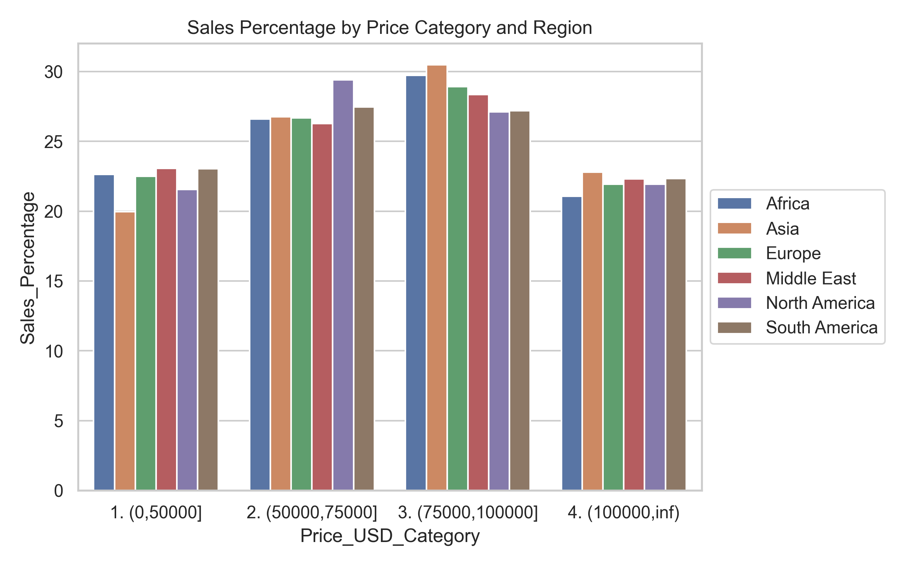
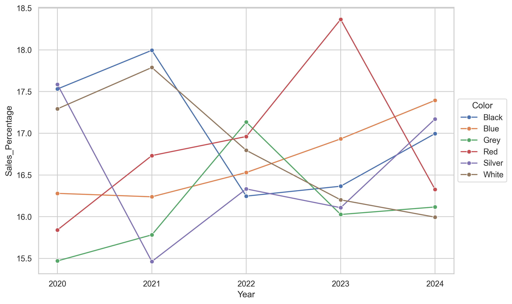

## **Business Question 1**
The business question: Analyze sales performance trend over time. Dimensions to be considered are year, and year plus region.

### **Main Finding**
From 2020 to 2024, BMW vehicle sales exhibited a fluctuating trend. Sales increased from 16,310,843 units in 2020 to a peak of 17,920,946 units in 2022, followed by a decline in 2023 to 16,268,654 units. By 2024, sales rebounded to 17,527,854 units, indicating an overall upward trend despite the dip in 2023.

Regionally, similar patterns were observed. Africa, Asia, and South America saw sales rise from 2020 to 2022, decline in 2023, and rise again in 2024. Europe followed a similar pattern, with a consistent increase until 2022, a drop in 2023, and a slight recovery in 2024. The Middle East peaked in 2020, experienced fluctuations, declined in 2023, and slightly increased in 2024. North America showed an erratic trend, with a decrease in 2021, a rise in 2022, a slight decline in 2023, and a further decrease in 2024.

Overall, the data suggests that while there were regional variations, most regions experienced a recovery or growth by 2024 after the dip in 2023, indicating a general resilience in the market.

### **Supporting Figures**

  
  

## **Business Question 2**
The business question: Highlight top-performing and under-performing models or markets.

### **Main Finding**
The "7 Series" is the top-performing BMW model with 8,177,442 units sold, followed by the "X6," "M5," and "3 Series." Conversely, the "i3" and "X5" are under-performing, with the lowest sales among the models analyzed.

Regionally, Europe is the top-performing market with 14,565,989 units sold, followed by the Middle East and North America. Africa and Asia have moderate sales volumes, while South America is the under-performing market with the lowest sales volume.

Overall, luxury and sports models like the "7 Series" and "X6" are successful, while models like the "i3" and "X5" lag behind. Europe, the Middle East, and North America are strong markets, whereas South America shows the least performance.

### **Supporting Figures**

    
    

## **Business Question 3**
The business question: Explore key drivers of sales (e.g., price, market segment, or model type), compare across dimensions. Market segment refers to color, fuel_type, transmission, and engine_size. For price and engine_size, use Price_USD_Category and Engine_Size_L_Category fields.

### **Main Finding**
Key drivers of BMW sales include mid-range pricing, specific models, colors, fuel types, transmissions, and engine sizes. Mid-range priced BMWs ($75,000-$100,000) have the highest demand. The "7 Series" leads in model sales, followed by the "X6" and "M5." Black cars have the highest sales volume, followed by Red and White. Hybrid vehicles are in high demand, followed by Electric and Petrol, with Diesel having the lowest sales. Manual transmissions are slightly more popular than Automatic. Smaller engine sizes, particularly the (0,2.4] category, have higher sales volumes.

Overall, mid-range pricing, certain models like the "7 Series," specific colors such as Black, Hybrid fuel types, Manual transmissions, and smaller engine sizes are key drivers of BMW sales.

### **Supporting Figures**

  
  
  

## **Business Question 4**
The business question: Identify product market fit of each region (e.g., model, color, fuel_type, transmission, Engine_Size_L_Category or Price_USD_Category). Highlight the regions with the highest sales percentage. Use sales percentage as the main metric.

### **Main Finding**
BMW sales across regions reveal distinct preferences. The 5 Series and 3 Series are popular across multiple regions, with the 7 Series leading in Africa and the Middle East, and the X5 and X6 performing well in North and South America. Black and White cars are consistently popular, with regional variations like Grey in the Middle East and Silver in North America. Hybrid and Electric vehicles are growing in Asia, Europe, and North America, while Petrol is dominant in Africa and the Middle East.

Automatic transmissions are slightly more popular in Africa and Asia, while manual transmissions are favored in Europe, the Middle East, North America, and South America. Smaller engine sizes dominate sales across all regions. The $75,000 to $100,000 price range generally has the highest sales percentage, except in North and South America where the $50,000 to $75,000 category is more prominent.

These insights highlight regional variations in consumer preferences and the importance of tailoring product offerings to meet specific market demands.

### **Supporting Figures**

    
    
    

## **Business Question 5**
The business question: Identify shift in consumer preferences over time (e.g., model, color, fuel_type, transmission, Engine_Size_L_Category or Price_USD_Category). In each dimension, there can be more than one preference that is favored by consumers. Use sales percentage as the main metric.

### **Main Finding**
From 2020 to 2024, consumer preferences for BMW models, colors, fuel types, transmissions, engine sizes, and price categories have shifted. The X6 and 5 Series gained traction in 2024, while the M3 and X5 declined. Red and Blue colors gained popularity, overtaking Silver and Black. Preferences shifted towards Electric and Hybrid vehicles, with Electric peaking in 2023 and Hybrid becoming most preferred in 2024. Diesel and Petrol declined.

Manual transmissions consistently surpassed automatic from 2021 onwards. Smaller engines, particularly the '1. (0,2.4]' and '2. (2.4,3.3]' categories, gained a larger share of sales. The '3. (75000,100000]' price category remained most preferred, despite minor fluctuations.

Overall, these shifts reflect a dynamic market with evolving consumer preferences across various dimensions.

### **Supporting Figures**

    
    
    

## **Conclusion**
The analysis of BMW sales data from 2020 to 2024 reveals a generally upward trend in sales, despite a temporary dip in 2023. Regional variations exist, but most regions showed recovery or growth by 2024. The "7 Series" and "X6" models are top performers, while the "i3" and "X5" lag behind. Europe, the Middle East, and North America are strong markets, whereas South America shows the least performance. Key sales drivers include mid-range pricing, specific models, colors, fuel types, transmissions, and engine sizes. Consumer preferences have shifted towards Electric and Hybrid vehicles, manual transmissions, and smaller engines over time. These insights highlight the importance of understanding regional and temporal variations in consumer preferences to tailor product offerings effectively.

## **Actionable Insight**
1. **Focus on Mid-Range Pricing**: Given the high demand for mid-range priced vehicles, BMW should continue to focus on this segment, ensuring competitive pricing and value offerings.
2. **Enhance Electric and Hybrid Offerings**: With a clear shift towards Electric and Hybrid vehicles, BMW should invest in expanding its lineup and infrastructure for these models to capture growing market demand.
3. **Tailor Regional Strategies**: Recognizing regional preferences, BMW should tailor its marketing and product strategies to align with specific consumer demands in each region, such as promoting the 7 Series in Africa and the Middle East or focusing on the X6 in South America.
4. **Monitor Consumer Trends**: Continuously monitor shifts in consumer preferences, particularly in color, transmission, and engine size, to adapt product offerings and maintain market relevance.