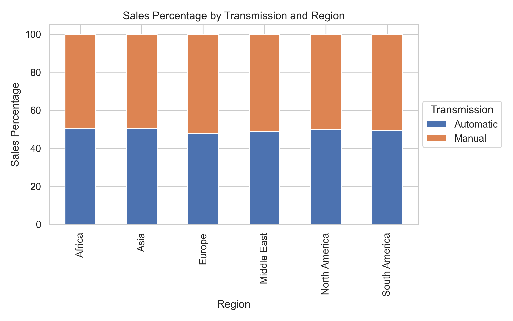

## **Business Question 1**
The business question: sales performance trend over time. Dimension to be considered is by year, and year plus region

### **Main Finding**
From 2020 to 2024, BMW's sales performance showed a fluctuating trend with an overall upward trajectory, despite a dip in 2023. Sales increased from 16,310,843 units in 2020 to a peak of 17,920,946 units in 2022, then declined to 16,268,654 units in 2023, before rebounding to 17,527,854 units in 2024. This indicates a resilient market performance with a temporary setback in 2023.

Regionally, Africa's sales peaked in 2022, declined in 2023, and slightly recovered in 2024. Asia showed consistent growth, reaching 3,080,909 units in 2024 from 2,407,513 units in 2020. Europe saw a rise until 2022, followed by a dip in 2023 and a slight decrease in 2024. The Middle East maintained stable sales with minor fluctuations, peaking in 2022. North America displayed an upward trend, peaking in 2022, with slight declines thereafter. South America grew until 2022, declined in 2023, and partially recovered in 2024.

Overall, Asia and North America demonstrated consistent growth, while other regions experienced more fluctuations. This highlights the importance of regional market dynamics in understanding BMW's global sales trends over the five-year period.

### **Supporting Figures**

    
    

## **Business Question 2**
The business question: highlight top-performing and underperforming models or markets.

### **Main Finding**
The "7 Series" and "X6" are the top-performing models, with sales volumes of 8,177,442 and 8,099,240 units, respectively. The "M5" and "3 Series" also show strong sales. In contrast, the "X5," "i3," and "M3" are underperforming, with lower sales volumes. This suggests a consumer preference for the "7 Series" and "X6," while the "X5" and "i3" are less favored.

Regionally, Europe is the top-performing market with 14,565,989 units, followed by the Middle East and North America. Africa and Asia have moderate sales, while South America is underperforming with the lowest sales volume of 13,643,807 units. This highlights Europe, the Middle East, and North America as key markets, while South America presents potential for growth.

Overall, the "7 Series" and "X6" lead in sales, particularly in Europe, the Middle East, and North America. Meanwhile, the "X5" and "i3," along with South America, represent areas for improvement.

### **Supporting Figures**

  
  

## **Business Question 3**
The business question: explore key drivers of sales (e.g., price, market segment, or model type), compare across dimensions. Market segment refers to color, fuel_type, transmission, and engine_size. For price and engine_size, use Price_USD_Category and Engine_Size_L_Category fields.

### **Main Finding**
Key drivers of BMW sales include mid-range pricing, specific models, color, fuel type, transmission, and engine size. Mid-range priced BMWs ($75,000-$100,000) have the highest demand, with 24,309,128 units sold. The 7 Series, X6, and 3 Series are the most popular models, with the 7 Series leading at 8,177,442 units. The X5 has the lowest sales volume.

Color preferences show Black, Red, and White as most popular, with Black leading at 14,450,883 units. Hybrid vehicles have the highest sales volume at 21,712,670 units, followed by Electric vehicles, while Diesel vehicles have the lowest sales. Manual transmissions are slightly preferred, with 43,066,966 units sold compared to 41,845,997 for automatic.

Smaller engine sizes have higher sales, with the smallest category (0,2.4] leading at 22,515,123 units. Mid-range engine sizes see a decrease, while the largest category (4.1,5.0] experiences a slight recovery. Overall, mid-range pricing, specific models, certain colors, hybrid and electric fuel types, manual transmissions, and smaller engine sizes are key sales drivers.

### **Supporting Figures**

    
    
    

## **Business Question 4**
The business question: identify product market fit of each region.

### **Main Finding**
BMW's market performance varies across regions in terms of sales volume, pricing, model popularity, fuel type, transmission, and color preferences. Europe leads in sales, followed by the Middle East and North America. Africa shows strong demand, while Asia and South America have lower sales volumes. Asia commands the highest average price, while South America offers the most affordable pricing.

The 3 Series and 5 Series are popular across regions, with the X6 and i3 gaining traction in South America. Hybrid and Electric vehicles are popular, especially in Europe and North America. Manual transmissions are slightly more favored in Europe and the Middle East, while North America prefers automatic.

Color preferences vary, with Blue most preferred in Africa, Black in Asia, Red in Europe and North America, Grey in the Middle East, and White in South America. These findings highlight the need for regional customization in product offerings to align with local consumer preferences and market dynamics.

### **Supporting Figures**

    
    
    

## **Business Question 5**
The business question: shift in consumer preference over time (e.g., model, color, fuel_type, transmission, Engine_Size_L_Category or Price_USD_Category). Use sales percentage as main metric.

### **Main Finding**
From 2020 to 2024, consumer preferences for BMW models, colors, fuel types, transmission types, engine sizes, and price categories have shifted. The X6 and 5 Series gained popularity in 2024, while the M3 and X5 declined. The 7 Series maintained a strong presence, and the i3 and i8 showed fluctuations. Blue and Red gained popularity, with Blue most favored in 2024, while Black and Silver fluctuated.

Hybrid vehicles consistently gained popularity, while diesel and petrol declined. Electric vehicles fluctuated but remained significant. Manual transmissions saw a trend, though the gap with automatic transmissions narrowed by 2024. Smaller engine sizes (0 to 3.3 liters) became more popular, while larger sizes (3.3 to 5.0 liters) decreased. Price preferences shifted slightly towards more affordable vehicles. These findings highlight evolving consumer preferences over the analyzed period.

### **Supporting Figures**

    
    
    

## **Conclusion**
The analysis of BMW's sales data from 2020 to 2024 reveals a generally positive trend in sales performance, with a temporary dip in 2023. Asia and North America have shown consistent growth, while other regions experienced fluctuations. The "7 Series" and "X6" models are top performers, particularly in Europe, the Middle East, and North America, while the "X5" and "i3" models, along with the South American market, present opportunities for improvement. Key sales drivers include mid-range pricing, specific models, certain colors, hybrid and electric fuel types, manual transmissions, and smaller engine sizes. Regional customization is crucial to align with local consumer preferences and market dynamics. Consumer preferences have evolved over time, with shifts towards hybrid vehicles, smaller engine sizes, and more affordable pricing.

## **Actionable Insight**
1. **Focus on Growth Markets**: Invest in marketing and distribution strategies in Asia and North America to capitalize on their consistent growth.
2. **Enhance Underperforming Models**: Consider redesigning or repositioning the "X5" and "i3" models to better meet consumer preferences and increase their market appeal.
3. **Leverage Top Models**: Continue to promote the "7 Series" and "X6" models in key markets to maintain their strong sales performance.
4. **Regional Customization**: Tailor product offerings to align with regional preferences, such as color and transmission type, to enhance product-market fit.
5. **Sustainability Focus**: Emphasize hybrid and electric vehicle options in marketing campaigns to align with the growing consumer interest in sustainable technologies.
6. **Affordable Pricing Strategy**: Explore opportunities to offer more competitively priced models to attract price-sensitive consumers and expand market share.